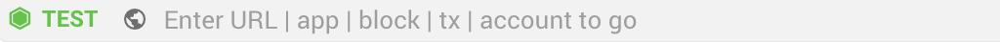

Sync is providing a seamless experience for users and developers ,it's easy to connect to websites but also decentralize application (DApps). Once the Sync is opened, it will automatically connect to the built-in node.  

##  Network's Name
 There is a tag shown before the node's name and network status . it show the network  
*   **MAIN**  /  **TEST** / **SOLO** / **UNKNOWN**

>SOLO is [standalone mode](https://github.com/vechain/thor#sub-commands)

>UNKNOWN is a network which is not official listed 

## Network Status 
 There are three colors show the network status : 
 1.  **Green**  :  The node is synced
 2.   **Orange** : The node is  syncing 
 3. **Red** :  The node is out of sync 

## Choose the Network and Node 
### Connect to Built-in Node
1. Click on the network ,at left of the address bar(it shown the network MAIN/TEST/SOLO/UNKNOWN)

2. Choose the network and node you would like to connect

### Add  Custom Node 
1. At top right, click  
2. Click **Settings** 
3. Click **Add Node** on Nodes section
4. Input the name which can help you to identity the node 
5. Input the URL with port (ex:http://localhost:8669)
6. Wait for a sec ,it will automatically identity the network name (MAIN/TEST/SOLO/UNKNOWN) and add the node to the list
7. At the left of the address bar,clock on the network, 
8. Choose the network and node you would like to connect
    

    
### Edit  Custom Node's Name
    
1. At top right, click  
2. Click **Settings** 
3. Click **Add Node** on Nodes section
4. Click **EDIT** 
5. Change the node's name
6. Click **SAVE**
    
### Delete  Custom Node
    
1. At top right, click  
2. Click **Settings** 
3. Click  **Add Node** on Nodes section
4. Click **EDIT** 
5. Click **DELETE**

## Go to DApps or Websites
1. At the top center, input the website/DAppS name or URL in the address bar

2. Pick a suggestion/recently visited, or press Return/Enter to go directly to the address you typed.

## Open New Tab 
At the top of the window, next to the last tab on the right, click  to open new tab

## Shortcuts  
*  Add new shortcut 
    1. At right of the address bar , Click 

    2. Click **Add shortcut**" to confirm.If you want to dismiss the action, you can click anywhere to cancel the action

* Remove shortcut
    1. In DApp/website
        1. At right of the address bar , Click 
        2. Click **Remove shortcut**" to confirm.If you want to cancel, you can click anywhere to cancel the action

    2. In homepage
        1. Move-over your pointer to the shortcut which you want to remove and wait for a second.
        2. Click the  at top right 
        3. Click **REMOVE**

* Edit shortcut's name
     1. Move-over your pointer to the shortcut which you want to edit
     2. Click the  at top right 
     3. Input the name which you would like to name the shortcut
     4. Click **SAVE** to finished the editing.